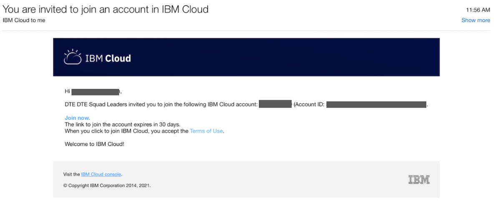
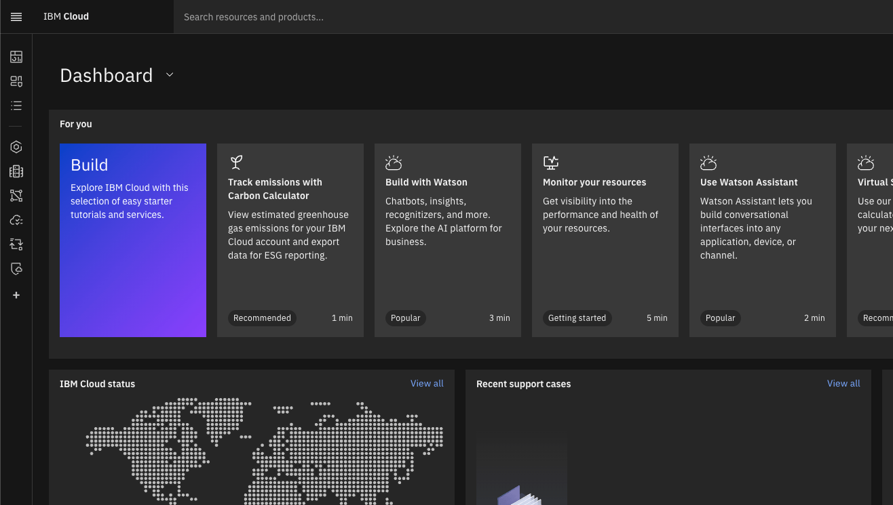
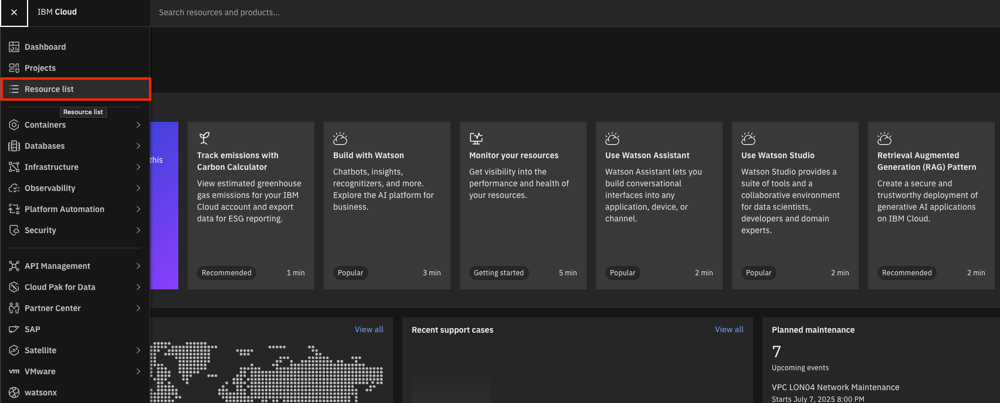
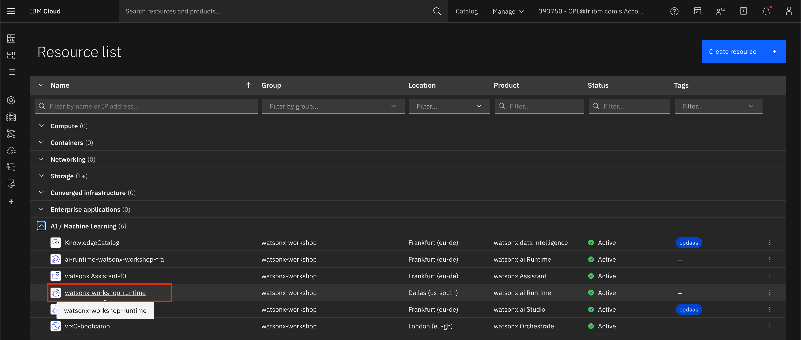
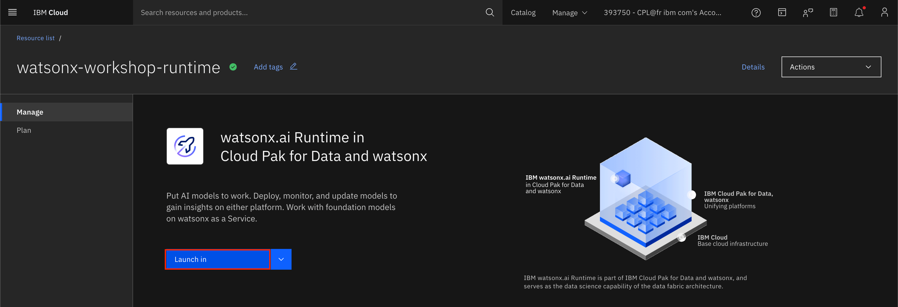
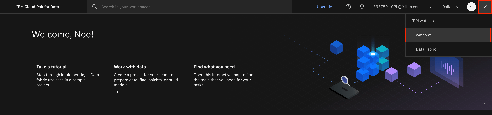
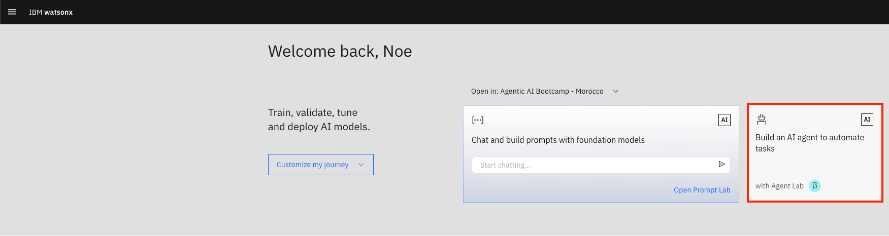
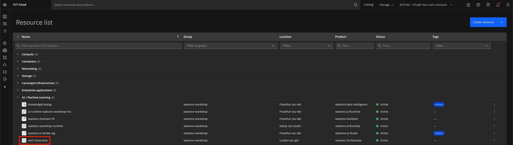
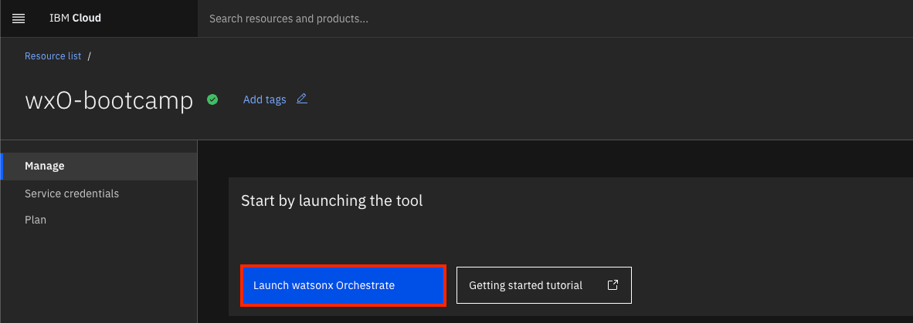
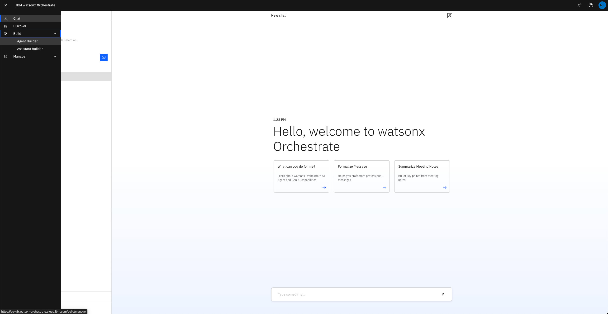

# How to access your lab environment

## Step 1: Accept IBM Cloud Invite through your email

1. Navigate to your email. You should have received an email titled ***"You are invited to join an account in IBM Cloud"***.
    
2. Inside the email titled ***"You are invited to join an account in IBM Cloud"***, click **Join now**:
    
3. You will be taken to a page where you are required to fill in your IBMid credentials. Register an IBMid **with the same email used for the invite** (if you don't have one already) and login.
4. After login, you should be on the IBM Cloud Dashboard for that account you have been invited to:
    

## Step 2: Access watsonx.ai

1. From the top left menu on the [IBM Cloud Dashboard](https://cloud.ibm.com/), click **Resource list**:
    
2. In the resource list, expand **AI / Machine Learning** and click your **watsonx.ai Runtime** instance (in **Dallas** region):
    
3. From the watsonx.ai Runtime service page, click **Launch in**:
    
4. Follow the steps and wait to be in Cloud Pak for Data dashboard, then click **watsonx** on the top right menu to be redirected to **watsonx.ai**:
    
5. That's it, you should now be in the watsonx.ai dashboard and ready to proceed to **Agent Lab**!
    

## Step 3: Access watsonx Orchestrate

1. From the top left menu on the [IBM Cloud Dashboard](https://cloud.ibm.com/), click **Resource list**:
    
2. In the resource list, expand **AI / Machine Learning** and click your **watsonx Orchestrate** instance:
    
2. From the Orchestrate service page, click **Launch watsonx Orchestrate**:
    
3. You should now be redirected to your watsonx Orchestrate service, ready to start your lab!
    