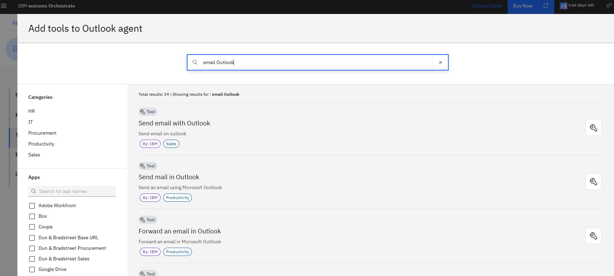
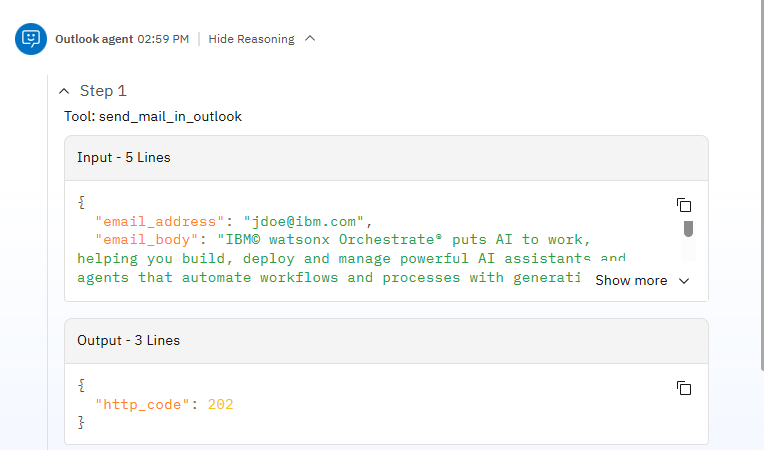

## Microsoft 365 Agent

## 🔍 Introduction

In this lab you will create an agent that can manage and process emails and calendar events through Outlook integration. The agent will use a application account and mailbox, not a personal one. This agent could be integrated in an existing agentic AI application so that you can for example send by email information extracted along the conversation to the user or as another example send a calendar invitation as a outcome of a process. 


## __________ 🔧 Lab Instructions __________

In this lab, you'll build a single agent that can handle emails and calendar events. You will use watsonx Orchestrate predefined tools for Microsoft 365 to build this agent.

### Prerequisites
- Access to your assigned watsonx Orchestrate instance
- Familiarity with AI agent concepts (e.g. instructions, tools, collaborators...)
- Access to a shared Microsoft 365 developer program subscription, shared by instructor

### Lab Steps Overview

1. Connect to watsonx Orchestrate
2. Set the Outlook connection
3. Create the Outlook agent
4. Test the agent


### 🚀🚀🚀 Let's get started! 🚀🚀🚀 <!-- omit in toc -->


## 1. Connect to your assigned Watsonx Orchestrate instance

Access the watsonx Orchestrate instance provided by your instructor.


## 2. Set the Outlook connection

Our agent will send email or calendar events using an applicative account. We will need to set the credentials once for the instance, through a Teams credendials. 
In wastonx Orchestrate, open the menu and go to `Manage > Connections`. Search for `outlook` and find the `MS Outlook` connection. Click on the edit icon on end otf the line.
Select **Key Value Pair**  ans **Teams credentials** radio button.


Fill all fields with the values provided by the instructors for this session.


- Client Id: 
- Client Secret: 
- Username: wxo-agent@xxxxx.onmicrosoft.com
- Password: 
- Authority: https://login.microsoftonline.com/xxxxxxxxxxxxx
- Base Url: https://graph.microsoft.com

When done, click **Connect** and then **Save**.


## 3. Create the Outlook agent

In wastonx Orchestrate, open the menu and go to `Build > Agent Builder`. Click the **Create agent** button. Name the agent `Outlook agent`.

Enter the following description:
```
Your are an agent that sends emails or creates calendar events. This agent utilizes an Applicative ID to authenticate and authorize email sending, ensuring secure and controlled communication. 
```


Click on Toolset section in the left menu of the agent then click **Add tool**. Select **Add from catalog**. Search for `email Outlook` :



Select **Send mail in Outlook**. Review the tool configuration and click **Add to agent**. When the tool has been added, click **Edit details**. Review the input parameters to understand how it will use this tool.


Click again **Add tool**. Select **Add from catalog**. Search for `event Outlook` :


Select **Create event in Outlook** and then **Add to agent**. When the tool has been added, click **Edit details**.  Have a look to the description of all parameters, review which parameters are required and which are not, have a look to the format of date, duration, etc. 


Now that we have added the tools, let's define the agent behavior. Click on the **Behavior** section of the menu and enter the instructions for your agent.

```
You can send email or create a calendar event on user's requests.

When you are requested to send an email or create a calendar event, ensure you are using a valid email address.  Ask to the user for its email address if you don't have it and ask if additional recipients shoud be added.
 
Set events to be online by default. If duration are not specified, use 60 min as the default.
```

## 3. Test the Outlook agent

On the right side of the screen, send a prompt to test the send email function.

```
 Send an email named "Welcome to Orchestrate" and with content "  IBM® watsonx Orchestrate® puts AI to work, helping you build, deploy and manage powerful AI assistants and agents that automate workflows and processes with generative AI.  Seamlessly integrate with your existing business systems. Connect to any AI model or automation tool. Enable collaboration between your AI assistants and agents in one unified experience.  The outcome? Less manual work. Faster decisions. A more efficient business, at scale."

```
In response , the agent should ask for recipient's email address as we do not specified it.


Open the **Show Reasoning** section



Ask the instructor to look for new sent emails in the agent mailbox.


Now, test the agent on the creation of a calendar entry, example:
```
create a meeting for 8am tomorrow to contact my ACME sales representative
```


See how the input parameters have been adapated to the instructions you gave to your agent (duration, online event).
Ask your instructor to look for your event in the shared mailbox. Depending on how you set time in your prompt and the timezone set for your agent's mailbox, the time of the event may vary. By default the calendar tool use UTC dates.


 


