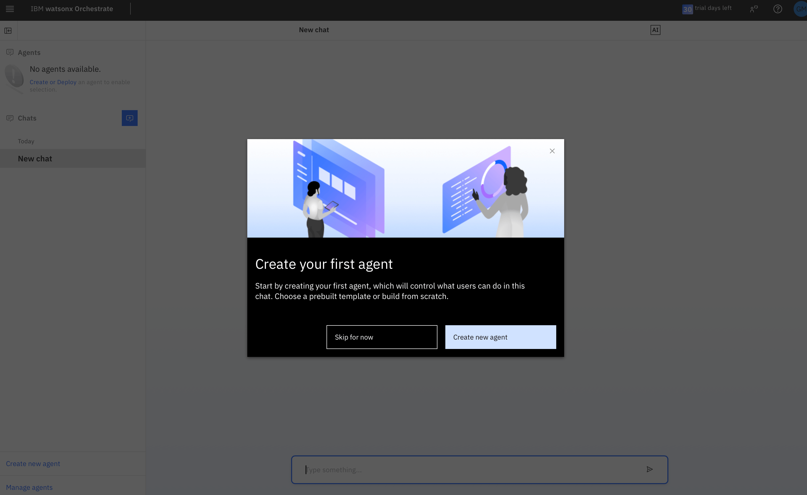

# ✅ Watsonx Orchestrate LAB for JIRA Task Management  
### (low-code approach)

This guide walks you through setting up a JIRA Task Management system using IBM Watsonx Orchestrate. You'll create a single low-code agent that connects to Atlassian JIRA and enables users to manage tasks using natural language commands.

The agent allows users to create issues, assign tasks, update statuses, and retrieve project-related information — all without navigating the JIRA interface — helping teams stay organized, save time, and reduce manual tracking errors.

## Step 1: Connect to the Watsonx Orchestrate Trial instance 

1. Navigate to IBM Cloud page: https://cloud.ibm.com/resources and click on the link "AI / Machine Learning"
2. Select. Watsonx Orchestrate and Click launch to access the trial instance.
   
   
   
   

## Step 2: Create the AI Agent – JIRA Task Management Agent

1. Click the **"Create new agent"** link at the bottom  

   

2. Select **"Create from template"** option  
3. Enter the Name as: `Jira Issue management`  
4. Click "Issue management" agent.

   `An agent to create, update, retrieve and delete Jira issues.`

    

5. Click "Use as template". 

    

6. Access the Agent Workspace

    After clicking **"Use as template"**, you will be automatically redirected to the **agent configuration workspace**.

    Here, you'll see the `Issue management` agent pre-populated with Jira-related tools.

    
    

    You can now:

   
- View and customize the agent’s **Toolset**  
- Add, remove, or edit tools like:
  - `Create an issue in Jira`
  - `Delete an issue in Jira`
  - `Get issues in Jira`
  - `Get projects in Jira`
  - `Get project issue types in Jira`
  - `Get issue priorities in Jira`
  - `Get users in Jira`
  - `Update an issue in Jira`

> 💡 **Note:**  
> Instead of using a prebuilt agent template, you can also use any individual Jira tool on its own.  
> Simply create a new agent **from scratch**, and add only the tool you need (e.g., “Create an issue in Jira”).  
> This is useful when you want to create focused agents for specific tasks.

## Step 3: Connect Watsonx Orchestrate to JIRA

> ✅ **Note:**  
> If you have already created a Jira connection during earlier steps and it was successful,  
> you can safely skip this step and proceed to the next one.

To enable this integration, you must establish a secure connection that allows both platforms to communicate.  
_See **Managing connections** in the UI for more details._

1. Navigate to the Connections Page
- From the main menu, go to:  
  `Manage` → `Connections`
  

---

2. Locate Jira
- Use the search bar to find: **Jira**
- Identify the **connection ID** with format:  
  `jira_key_value_ibm_184bdbd3` and  `jira_basic_ibm_184bdbd3`
  

---

3. Edit the Connection for Jira Basic
- Click **Edit** next to the matching connection ID.

---

4. Choose the Environment
- Select one of the following:
  - `Draft`: for testing and development  
  - `Live`: for production use

---

5. Set the Authentication Type
- Under **Authentication Type**, choose:  
  `Basic Auth` and put your Server URL 
  
- Under **Credential Type**, choose:

  `Team Credential` and write your `User Name` and `Password`
  - User Name enter your email you used to create a Jira Account, if you used Google your gmail address. Under Password enter the API-Token you created in Jira.

  
---

6. Click connect and Save
  

---

7. Edit the Connection for Jira URL
- Click **Edit** next to the matching connection ID.
---

8. Choose the Environment
- Select one of the following:
  - `Draft`: for testing and development  
  - `Live`: for production use
---

9. Set the Authentication Type
- Under **Authentication Type**, choose:  
  `Key Value Pair` 

- Under **Credential Type**, choose:

  `Team Credential` and write your `Base URL`. 

  
---

10. Click connect and Save
  

> 💡 **Note:**  
> To enable secure integration with Atlassian JIRA, the following credentials must be provided:  
> `base_url`, `username`, and `api_token`.

- **`base_url`** refers to your JIRA workspace URL, typically in the format:  
  `https://your-domain.atlassian.net`

- **`username`** must be your Atlassian account **email address** (e.g., `your.name@company.com`)

- **`api_token`** is a secure token generated from your Atlassian account.  
  You can obtain it by following these steps:<>

1. Go to: [https://id.atlassian.com/manage/api-tokens](https://id.atlassian.com/manage/api-tokens)  
2. Click **Create API token**  
3. Enter a label (e.g., `Orchestrate Agent`) and click **Create**  
4. Copy the token and save it securely — this will be used as your password during authentication.

> For more details, refer to Atlassian’s official documentation:  
> 👉 [Atlassian API tokens](https://support.atlassian.com/atlassian-account/docs/manage-api-tokens-for-your-atlassian-account/)

## Step 4: Use Jira Tools in Your Agent

### 🔍 Step 4.1: Retrieve All Projects from Jira

To get a list of all available Jira projects in your organization, use the tool:

#### 🛠️ Tool: `Get projects in Jira`

This tool retrieves the names, keys, and identifiers of all Jira projects that are accessible with your connected Jira account.

---

#### 📥 Inputs

This tool does **not require any input parameters.**  
Just call the tool and it will return the list of Jira projects your user has access to.

---

#### 📤 Output

The tool returns a list of project objects, each containing:

- `project_id`
- `project_key`
- `project_lead`
- `project_name`
- `project_type`

You can use this data to browse issues, create tickets, or integrate project-level automations.

---

#### 💬 Sample Prompt

> "List all available Jira projects"  
> "Show me the Jira projects I have access to"

---

### 📄 Step 4.2: Get All Issues from a Jira Project

Once you have selected a Jira project (e.g., "WxO Bootcamp") from the previous step,  
you can retrieve **all issues in that project** using the following tool:

#### 🛠️ Tool: `Get all issues in Jira project`

This tool lists all the issues (tickets) available in a specific Jira project.  
It is useful when you want to search, filter, or process tasks within a project.

---

#### 📥 Required Input

You will need to provide:

- `project_name` (**required**): The name of the Jira project (e.g., `"WxO Bootcamp"`)
- (Optional) `limit`: Number of issues to retrieve (default: 50)
- (Optional) `issue_number`: Specific issue number to filter
- (Optional) `next_page_token`: Use for pagination to get the next set of issues

> 🧠 **Example:** To retrieve issues from the "WxO Bootcamp" project, use `project_name = WxO Bootcamp`

---

#### 📤 Output

The tool returns a list of issue objects, each containing:

- `issues`: An array of issue objects (e.g., summaries, statuses, IDs, etc.)
- `next_page_token`: Used to retrieve the next page of issues, if pagination is needed

---

#### 💬 Sample Prompt

> "Get all issues from the 'WxO Bootcamp' Jira project"  
> "List the first 50 issues in the WxO Bootcamp project"

---

### 📝 Step 4.3: Create a New Issue in Jira

Once you’ve selected a Jira project and issue type,  
you can create a **new issue (e.g., Task, Story, Bug)** using the following tool:

#### 🛠️ Tool: `Create issue in Jira`

This tool allows you to create a new issue in a specific Jira project by providing required fields such as summary, project ID, and issue type.

---

#### 📥 Required Inputs

You must provide the following information:

- `summary` (**required**): A short title or summary for the issue  
- `project_id` (**required**): The ID of the target Jira project  
- `issuetype_id` (**required**): The ID of the issue type (e.g., Task, Story, Bug)

> 💡 **issuetype_id examples:**  
> Use one of the following values depending on the issue type you want to create:
>
> - **Epic** → `10001`  
> - **Subtask** → `10002`  
> - **Task** → `10003`  
> - **Story** → `10004`  
> - **Feature** → `10005`  
> - **Request** → `10006`  
> - **Bug** → `10007`

Optional inputs:

- `description`: A detailed description of the issue  
- `label`: A tag or label for categorizing the issue

---

#### 📤 Output

The tool returns:

- `issue_number`: The unique identifier (e.g., `WXO-101`) of the newly created issue

---

#### 💬 Sample Prompt

> "Create a task in WxO Bootcamp project titled 'Fix login bug'"  
> "Open a story in project 10000 with summary 'Add onboarding flow' and label 'UX'"

---

