# Watsonx Orchestrate LAB for SharePoint File Management  
### (low-code approach)

This guide walks you through setting up a SharePoint File Management system using IBM Watsonx Orchestrate. You'll create a single low-code agent that connects to Microsoft SharePoint and enables users to perform document-related actions using natural language commands.

The agent allows users to retrieve files, list folders, create new directories, and download documents directly from SharePoint — all without manual navigation — helping to streamline collaboration and reduce time spent searching for information.

## Step 1: Connect to the Watsonx Orchestrate Trial instance 

1. Navigate to IBM Cloud page: https://cloud.ibm.com/resources and click on the link "AI / Machine Learning"
2. Select. Watsonx Orchestrate and Click launch to access the trial instance.
   
   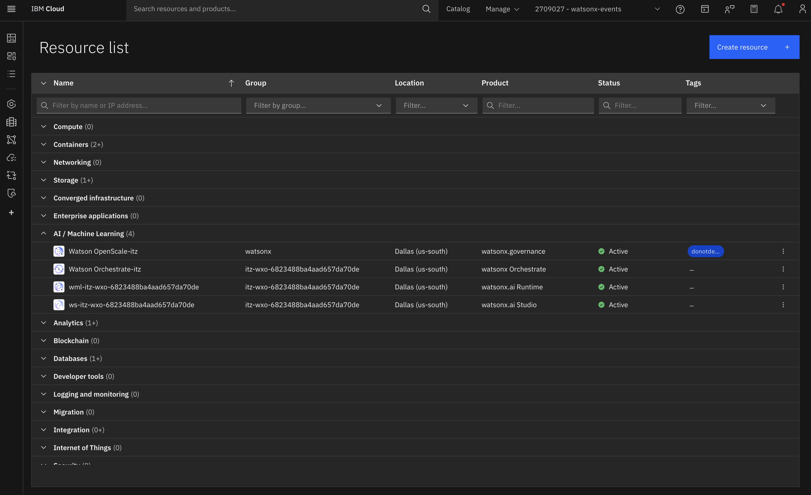
   
   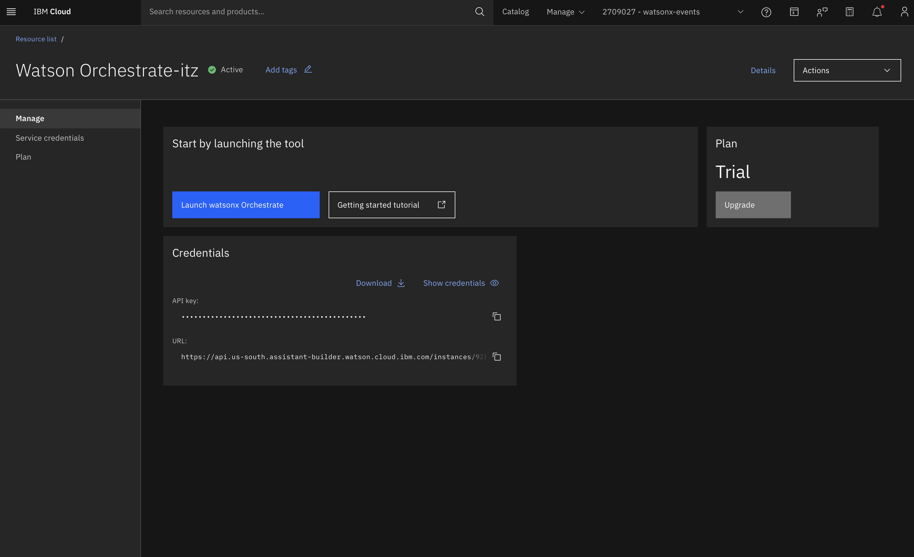

## Step 2: Create the AI Agent – SharePoint File Management Agent

1. Click the **"Create new agent"** link at the bottom  

   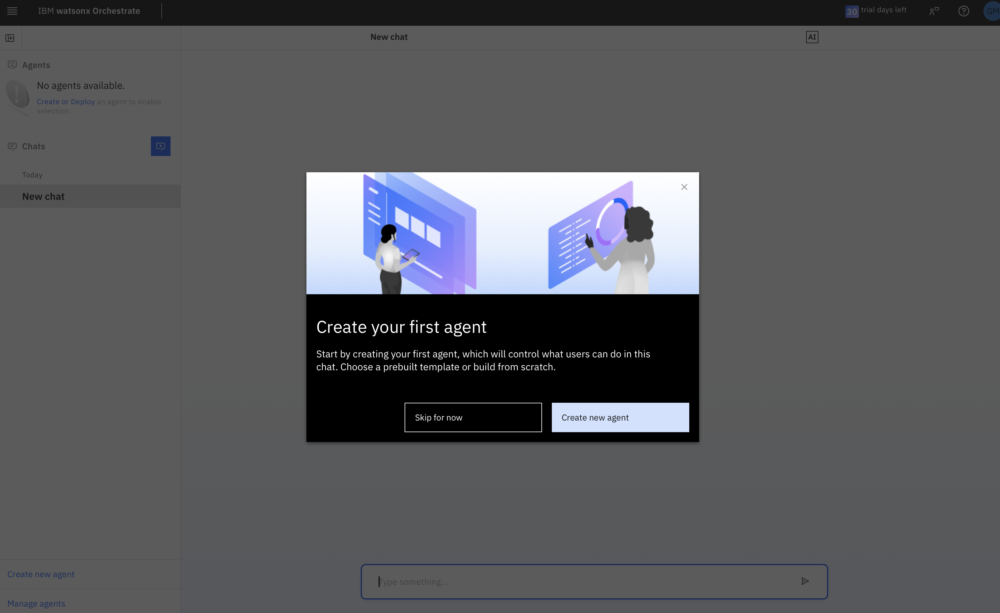

2. Select **"Create from template"** option  
3. Enter the Name as: `File management`  
4. Click  second "File management" agent.

   `An agent to manage files in Microsoft Sharepoint, with capabilities to create folders, and rename and download files.`

    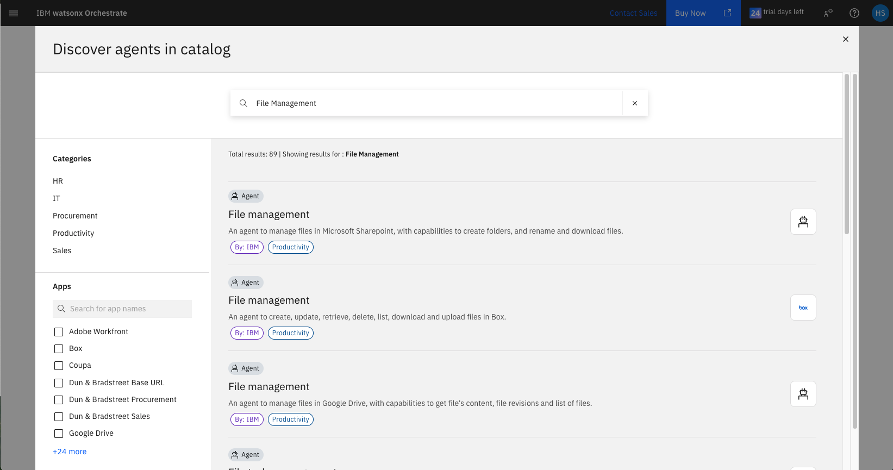

5. Click "Use as template". 

    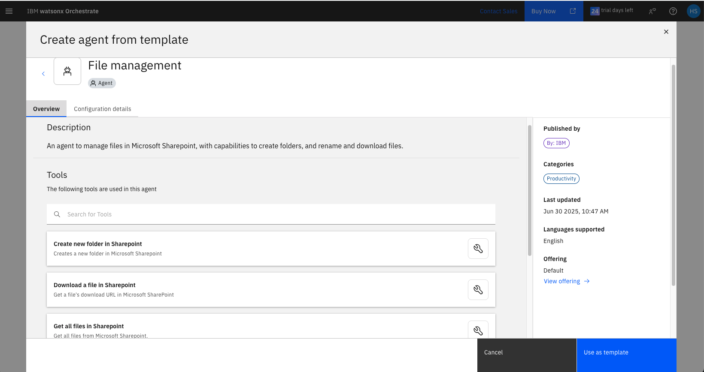

6. Access the Agent Workspace

    After clicking **"Use as template"**, you will be automatically redirected to the **agent configuration workspace**.

    Here, you'll see the `File management` agent pre-populated with SharePoint-related tools.

    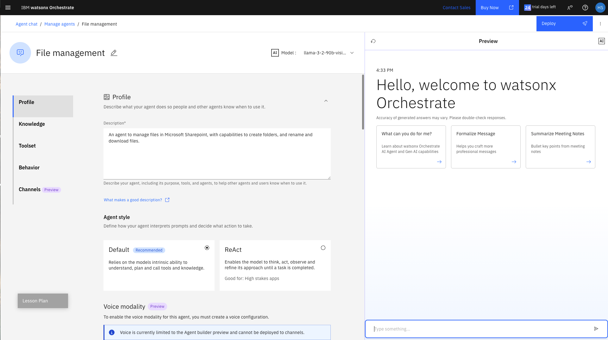
    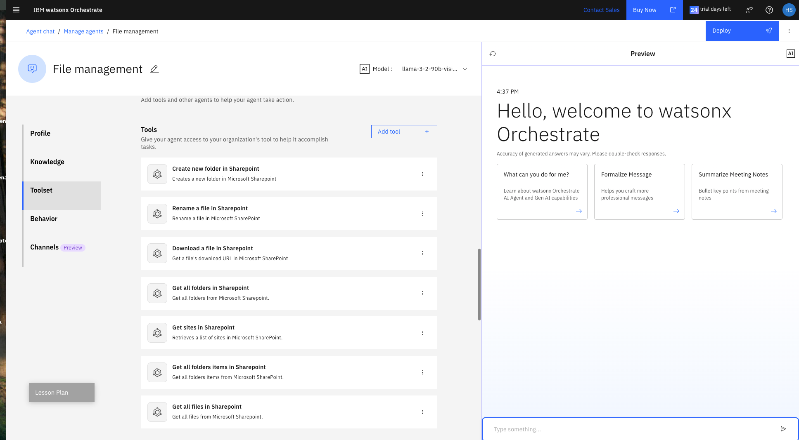

    You can now:

    - View and customize the agent’s **Toolset**  
    - Add, remove, or edit tools like:
      - `Create new folder in SharePoint`
      - `Rename a file in SharePoint`
      - `Download a file in SharePoint`
      - `Get sites in SharePoint`
      - `Get all folders and items in SharePoint`

> 💡 **Note:**  
> Instead of using a prebuilt agent template, you can also use any individual SharePoint tool on its own.  
> Simply create a new agent **from scratch**, and add only the tool you need (e.g., “Download a file in SharePoint”).  
> This is useful when you want to create focused agents for specific tasks.

## Step 3: Connect Watsonx Orchestrate to Microsoft Outlook

> ✅ **Note:**  
> If you have already created a Microsoft Outlook connection during earlier steps and it was successful,  
> you can safely skip this step and proceed to the next one.

Microsoft Outlook is a cloud-based service that helps you manage emails, calendars, contacts, and tasks.  
Integrating Outlook with IBM watsonx Orchestrate enables you to automate workflows, synchronize communication data, and streamline collaboration across your organization.

To enable this integration, you must establish a secure connection that allows both platforms to communicate.  
_See **Managing connections** in the UI for more details._

1. Navigate to the Connections Page
- From the main menu, go to:  
  `Manage` → `Connections`
  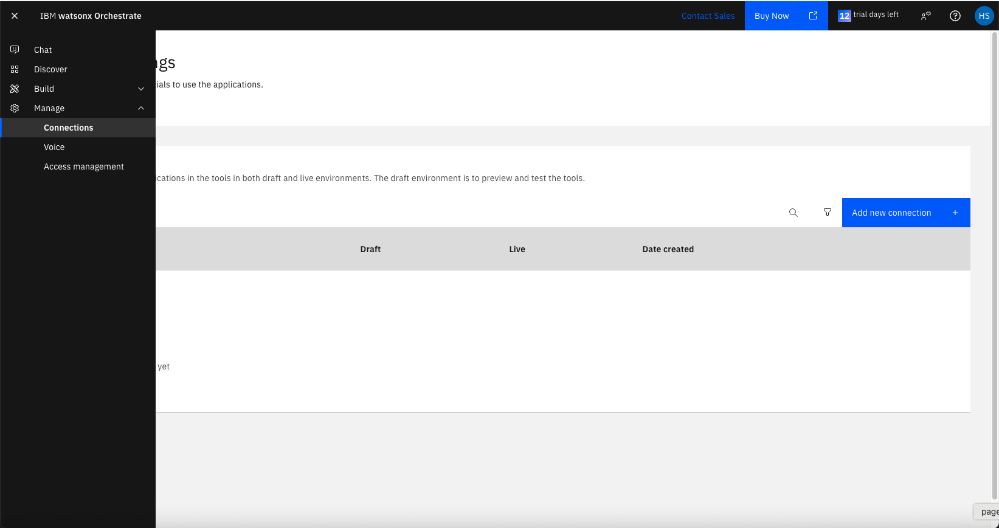

---

2. Locate Microsoft Outlook
- Use the search bar to find: **MS Outlook**
- Identify the **connection ID** with format:  
  `microsoft_key_value_ibm_184bdbd3`
  

---

3. Edit the Connection
- Click **Edit** next to the matching connection ID.

---

4. Choose the Environment
- Select one of the following:
  - `Draft`: for testing and development  
  - `Live`: for production use

---

5. Set the Authentication Type
- Under **Authentication Type**, choose:  
  `Key Value Pair`
  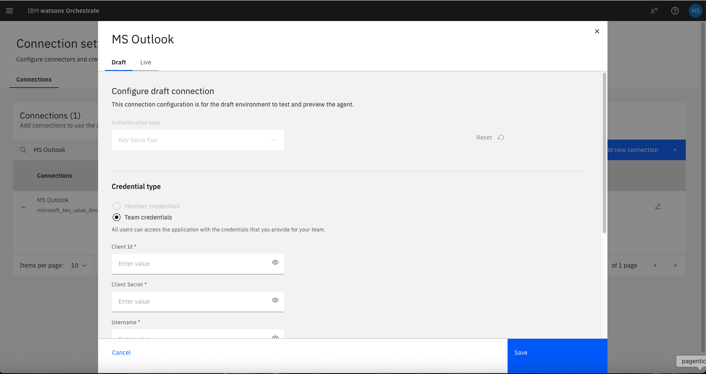
---

6. Enter the Required Key-Value Pairs
- Click **Add new field** to input each key and its corresponding value as shown below:

| **Key**         | **Description**                                                                 |
|------------------|----------------------------------------------------------------------------------|
| `client_id`      | The client ID of your registered Microsoft application                         |
| `client_secret`  | The client secret associated with your Microsoft app                           |
| `username`       | The Outlook account username (typically the email address)                     |
| `password`       | The password for the Outlook account or app-specific password                  |
| `authority`      | The authority URL for authentication                                            |
| `base_url`       | The base URL for Microsoft                                                     |

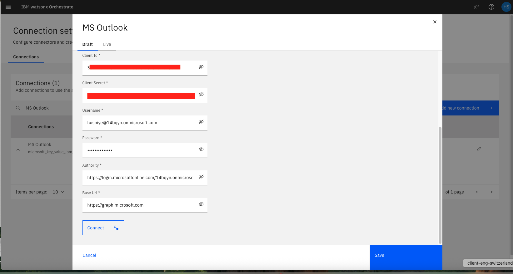
---

After filling in the required fields, click **Connect** button then click **Save** to complete the connection.

> 💡 **Note:**  
> The required credentials (`client_id`, `client_secret`, `username`, `password`, `authority`, `base_url`) must be obtained from your registered Microsoft Azure application.  
> For detailed instructions on how to register an application and retrieve these values, please refer to the official Microsoft 365 API documentation:  
> 👉 [Register an application with the Microsoft identity platform](./Microsoft_365_API.docx)

## Step 4:  Use SharePoint Tools in Your Agent

### 🔍 Step 4.1: Retrieve All Sites from SharePoint

To get a list of all available SharePoint sites connected to your organization, use the tool:

### 🛠️ Tool: `Get sites in SharePoint`

This tool retrieves the names, URLs, and identifiers of all sites that are accessible with the connected Microsoft account.

---

### 📥 Inputs

This tool does **not require any input parameters.**  
Just call the tool and it will return the list of sites your user has access to.

---

### 📤 Output

The tool returns a list of site objects, each containing:

- `site_id`
- `site_name`
- `site_url`
-`site_description`

You can use this data to navigate document libraries or select a specific site for folder/file operations.

---

### 💬 Sample Prompt

> "List all available SharePoint sites"  
> "Show me all SharePoint sites I can access"

---

### 📄 Step 4.2: Get All Files from a SharePoint Site

Once you have selected a SharePoint site (e.g., a Communication Site) from the previous step,  
you can retrieve **all files stored within that site** using the following tool:

### 🛠️ Tool: `Get all files in SharePoint`

This tool lists all the files available in a specific SharePoint site or document library.  
It is especially useful when you want to search, filter, or download documents stored in a particular location.

---

### 📥 Required Input

You will need to provide:

- `site_id`: The unique ID of the selected SharePoint site (from Step 4.1)  
- (Optional) `limit`: Limits the number of files to retrieve in Microsoft SharePoint.
- (Optional) `skip_token`: The number of files to skip for pagination purposes. Use this to retrieve subsequent pages of results when handling large datasets.

> 💡 **Tip:** If you're unsure which document library to target, use `site name` form previous step.

---

### 📤 Output

The tool returns a list of file objects, including:

- `file_name`
- `file_id`
- `file_path_url`

You can use this output to browse, preview, or download files in the next steps.

---

### 💬 Sample Prompt

> "Get all files from the 'Communication site' site"  
> "List all files in the HR site document library"

---

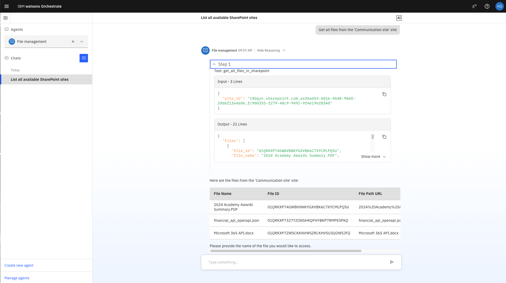

### 📥 Step 4.3: Download a File from SharePoint

After retrieving the list of files in a site (Step 4.2), you can use this tool to download any selected file.

### 🛠️ Tool: `Download a file in SharePoint`

This tool provides a **direct download link** for a file stored in a SharePoint document library.

---

### 📥 Expected Inputs (default behavior)

Under normal usage, this tool requires the following input parameters:

- `site_id`: The unique ID of the SharePoint site where the file is stored  
- `file_path`: The exact path of the file within the document library  

> Example file path: `2024 Academy Awards Summary.PDF`

---

### ✅ Conversation-Aware Behavior (our scenario)

In this guided lab scenario, you do **not** need to manually enter `site_id` or `file_path`.

Watsonx Orchestrate keeps track of the selected site and file from the previous steps in the conversation.  
The tool automatically uses this context to generate the download link for the correct file.

---

### 📤 Output

- `download_url`: A secure, direct link to download the selected file  
- Optional metadata (e.g., file name, size, type)

---

### 💬 Sample Prompts

> "Download the latest quarterly report"  
> "Get me the file called `Academy Awards Summary PDF`"  
> "Download the first file from the Marketing site"

---

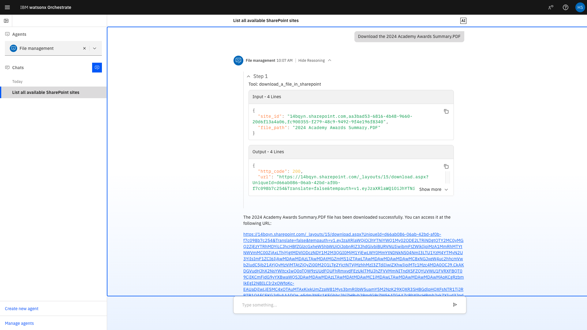
