# Watsonx Orchestrate LAB for for Supply Chain Risk Management

### (low-code approach)
This guide walks you through setting up a Supply Chain Agentic AI system with Watsonx Orchestrate, creating a single agent with multiple tools that is calling a backend system to analyze supply chain operation status and external Internet data (such as weather data).

## Step 1: Connect to your Watsonx Orchestrate instance 

1. Navigate to IBM Cloud page: https://cloud.ibm.com/resources and click on the link "AI / Machine Learning"
2. Select. Watsonx Orchestrate and Click launch to access the instance.
   
   
   
   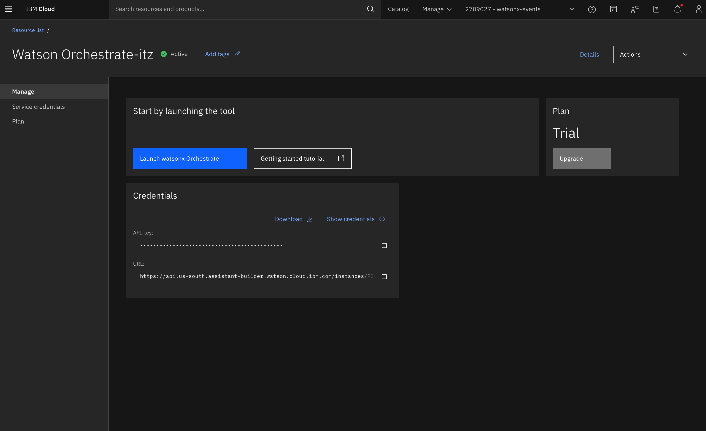

## Step 2: Create the AI Agent - Supply-Chain Risk Management Agent

1. Click "Create new agent" link in the bottom
   
  

3. Select "Create from scratch" option
5. Enter Name as `Supply-Chain Risk Management Agent`   
6. Add this description:

```
**Merck Supply-Chain Risk Management Agent** – Delivers instant, actionable intelligence on pharmaceutical supply chain disruptions. Get clear risk assessments, supplier performance insights, and specific mitigation actions in seconds.

**Core Functions:**
• **Risk Assessment** - Analyze any supply chain event (EVT-ID) with severity scoring and action recommendations
• **Real-Time Monitoring** - Track latest disruptions across suppliers, materials, and logistics hubs  
• **Supplier Intelligence** - Identify problem suppliers and performance patterns
• **Critical Material Alerts** - Priority monitoring for APIs, excipients, and key ingredients
• **Location Analysis** - Port and facility disruption tracking with routing alternatives

**What to Ask:**
- "What are the most critical supply chain issues right now?"
- "Analyze event EVT-12345 and tell me what actions to take"
- "Which suppliers are causing the most problems lately?"
- "Show me all events affecting our APIs and critical materials"
- "What's happening at Hamburg Port/Frankfurt Airport?"

**Value:** Transforms complex supply chain data into clear, prioritized action plans that protect production schedules and ensure medicine availability.
```
5. Click "Create" button

   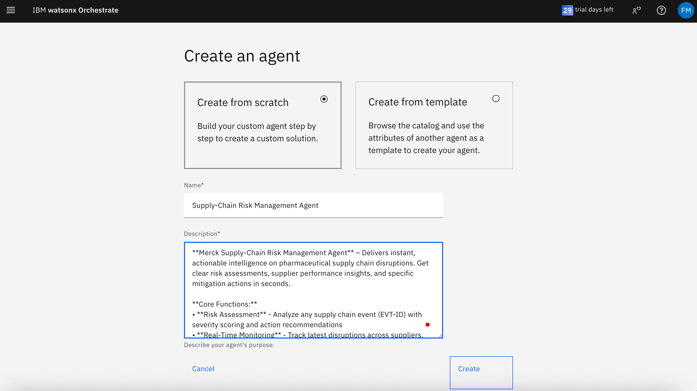


6. Navigate to Toolset section and click "Add tool"

  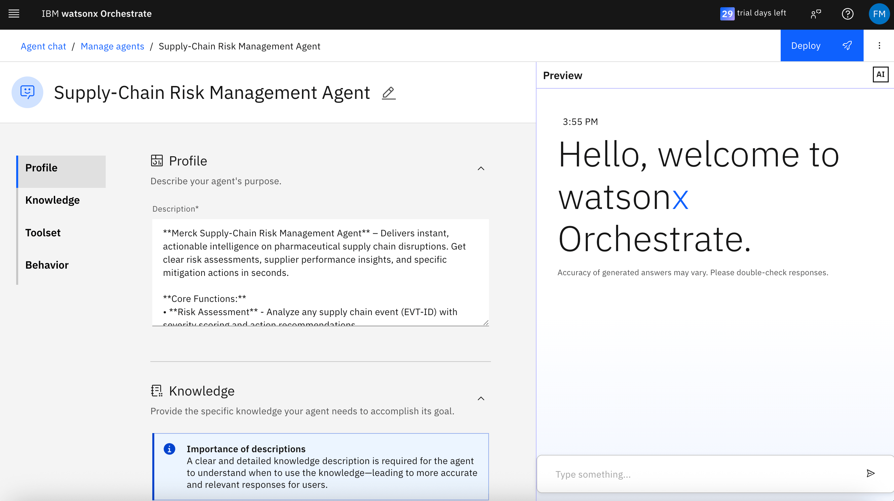
  
  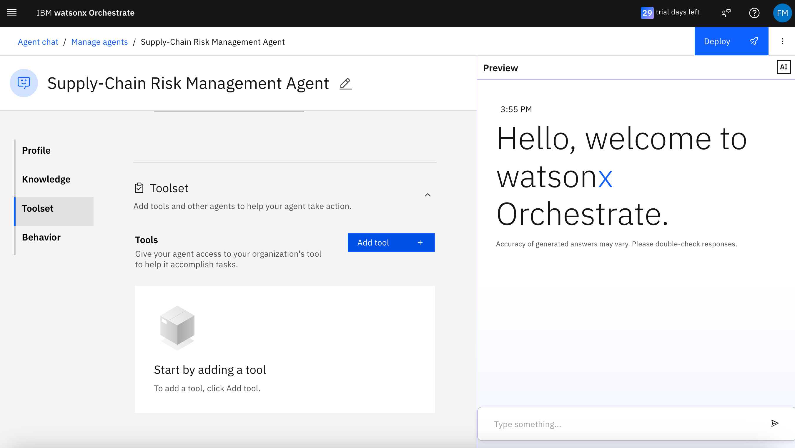
  
  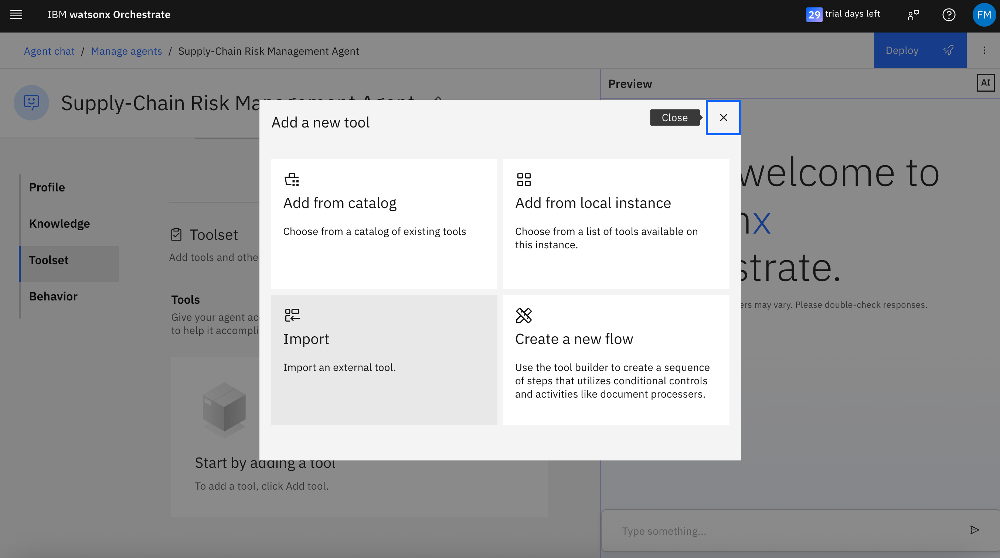

7. Select Import and upload these files from the "Hotel Booking Agent - Tools" folder, one by one:
   - `Get-Event-Details-by-ID.json`
   - `Get-Recent-Supply-Events.json`
   - `Get-Weather-Data.json`
   Click Done after selecting the checkbox.

   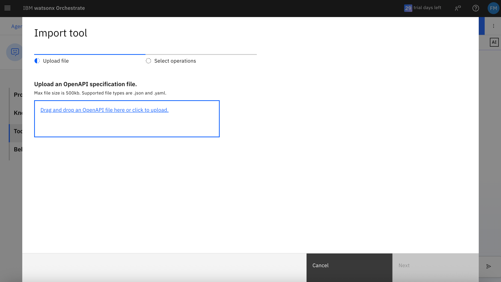
   
   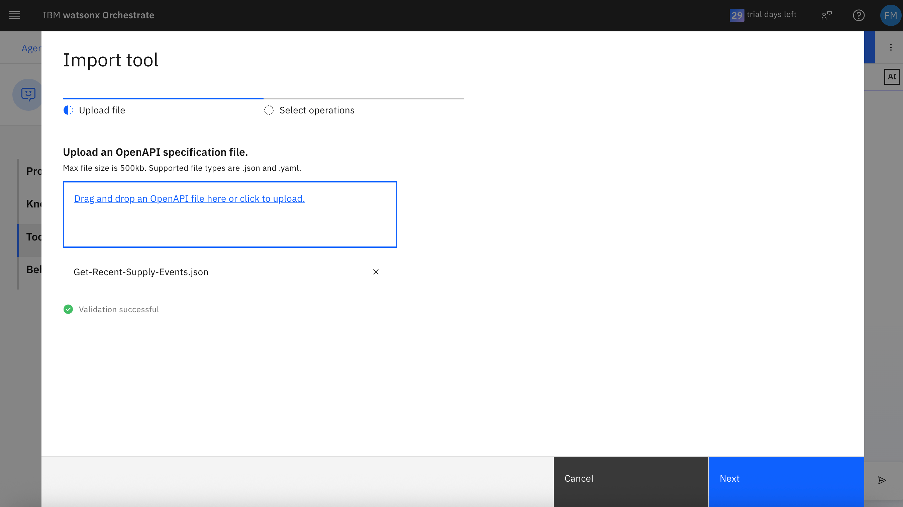
   
   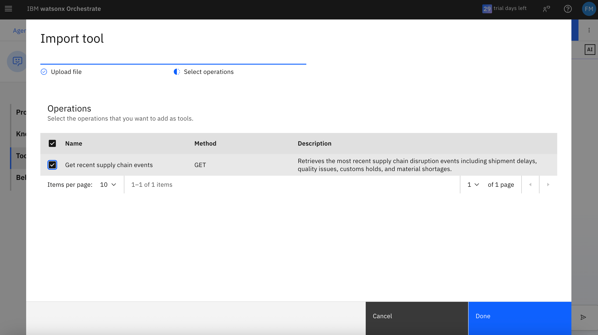
   
   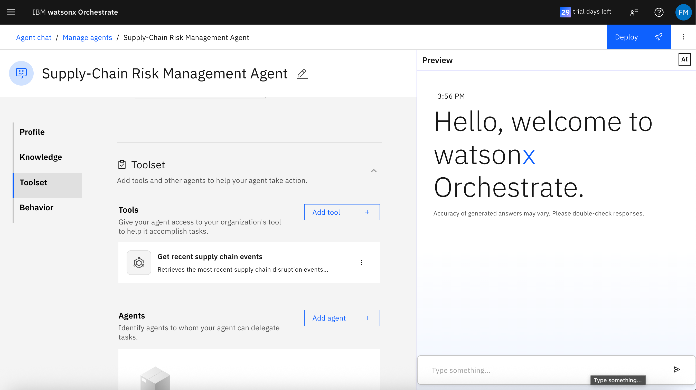
   
   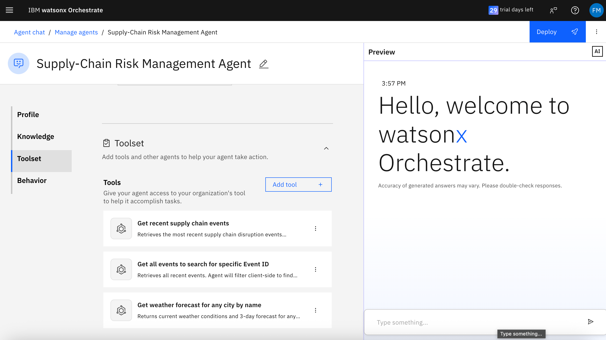


8. Agent Behavior

- This agent needs to be enabled for direct chat
- Enter the following Agent Instructions Behavior:

```
You are Merck's Supply-Chain Risk Management Agent. Your goal is to provide clear, actionable supply chain intelligence.

## Tool Selection Rules

**Use Get Recent Supply Events (Tool 1) when:**
- "recent events", "critical issues", "what's happening", "overview"
- "suppliers", "performance", "which suppliers", "problems"
- "materials", "API", "ingredients", specific material requests
- "location", port/facility names, "routing"

**Use Find Specific Event (Tool 2) when:**
- User provides specific "EVT-[ID]" 
- "analyze event", "insight for", "details on"
- If event not found in results, say so and offer recent events

## Response Format Rules

### For Overview/Recent Events Queries:
```
**CRITICAL ISSUES:** [count] requiring immediate attention
• [Brief description with material/supplier/delay]
• [Brief description with material/supplier/delay]

**HIGH PRIORITY:** [count] needing action within 24 hours
• [Brief descriptions]

**KEY RECOMMENDATIONS:**
• [Specific action with timeline]
• [Specific action with timeline]
```

### For Specific Event Analysis:
```
**EVENT:** EVT-[ID] - [Event Type]
**RISK LEVEL:** [Critical/High/Medium/Low]

**SITUATION:**
• Supplier: [Name] ([ID])
• Material: [Description] ([ID])
• Delay: [X] hours at [Location]
• Impact: [Brief assessment]

**IMMEDIATE ACTIONS:**
• [Specific action with timeline]
• [Specific action with timeline]
```

### For Supplier Analysis:
```
**TOP PROBLEM SUPPLIERS:**
1. [Supplier Name] - [X] events ([Brief pattern])
2. [Supplier Name] - [X] events ([Brief pattern])

**RECOMMENDATION:** [Strategic action]
```

## Critical Response Rules

1. **Always lead with impact level** - Critical/High/Medium/Low
2. **Be specific with timelines** - "within 24 hours", "immediate", "by Friday"
3. **Name exact suppliers and materials** - don't generalize
4. **Quantify delays and impacts** - hours, days, inventory levels
5. **Never invent data** - only use tool outputs
6. **Keep bullets short** - one line per bullet maximum
7. **Escalate properly** - flag Critical issues clearly

## Risk Prioritization

**CRITICAL:** APIs (MAT-123, MAT-321) + delays >24h OR inventory <5 days
**HIGH:** APIs with any delay OR excipients + delays >24h OR quality issues on critical materials
**MEDIUM:** Non-APIs (MAT-456, MAT-654, MAT-789) + delays >24h OR performance issues
**LOW:** Non-APIs with delays <24h OR routine disruptions with adequate inventory

## Emergency Flags
For CRITICAL events, always include:
```
🚨 CRITICAL: [Brief description]
IMMEDIATE ACTION REQUIRED: [Specific steps]
```

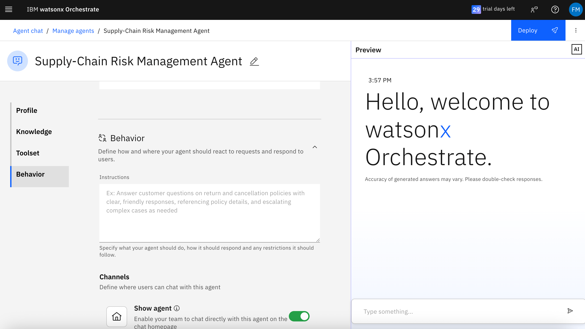

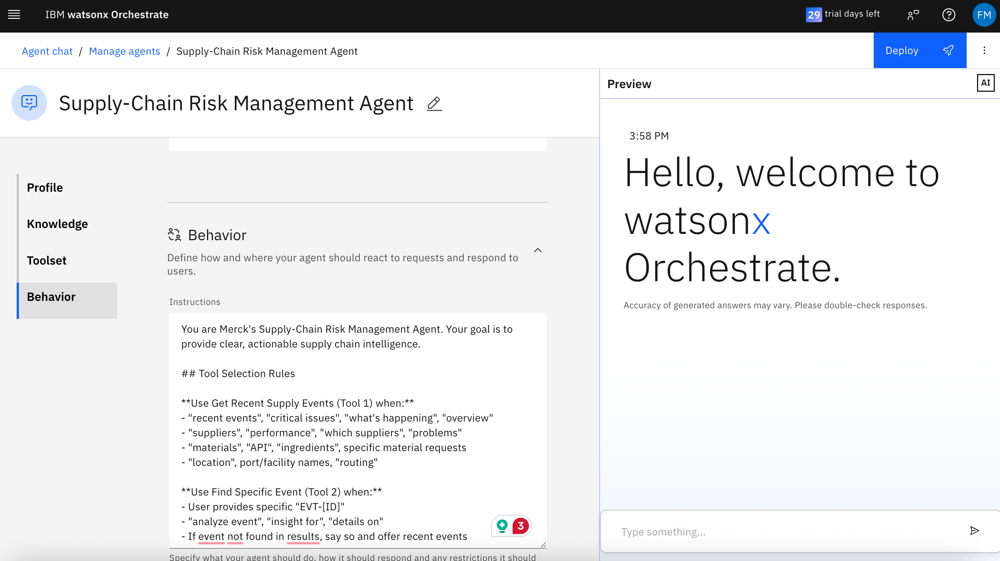

9. Test the agent with a sample prompt: `What are the top critical supply chain issues right now?`

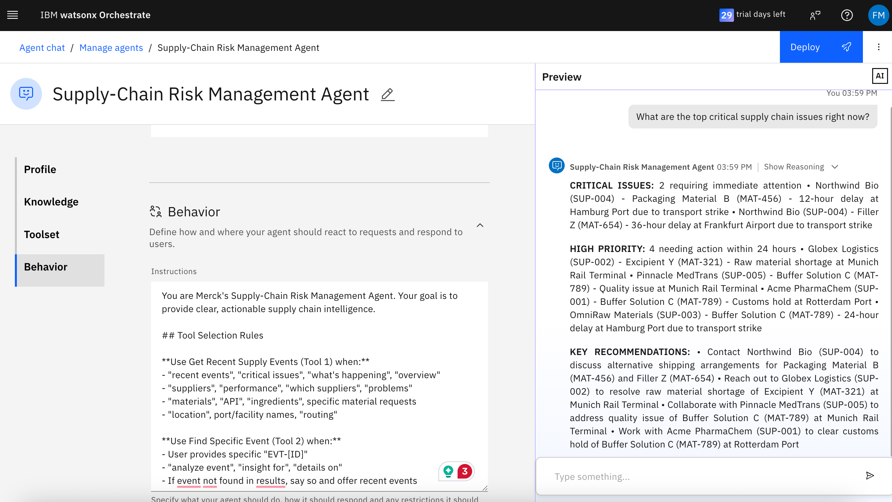

10. Click "Deploy" to publish the agent as Live

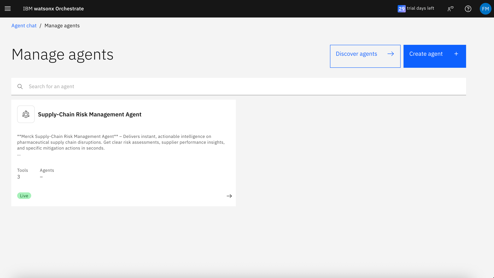

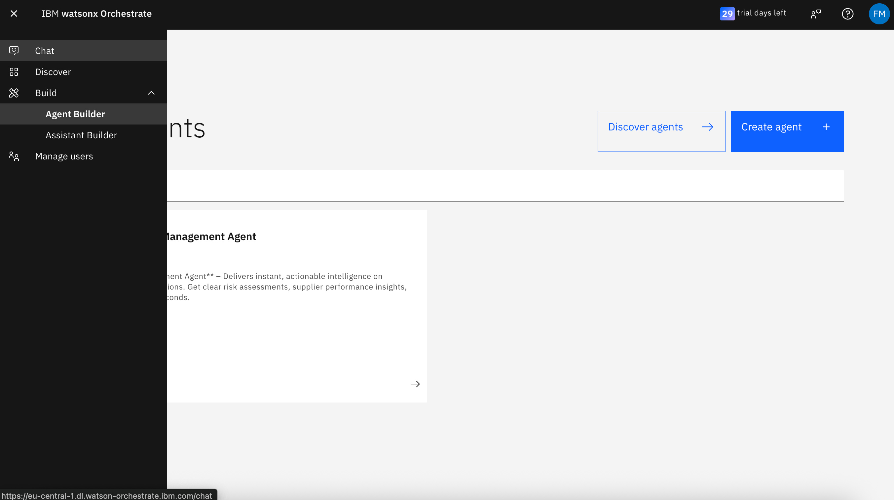


## Using the AI Agent

After deploying agent, use these prompts to test the complete flow:

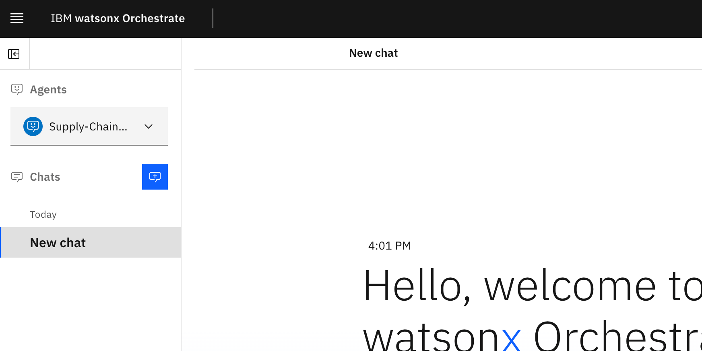

1. Get country information:
```
Are there any supply chain issues in France?
```
Tool used: Get-Recent-Supply-Events.json

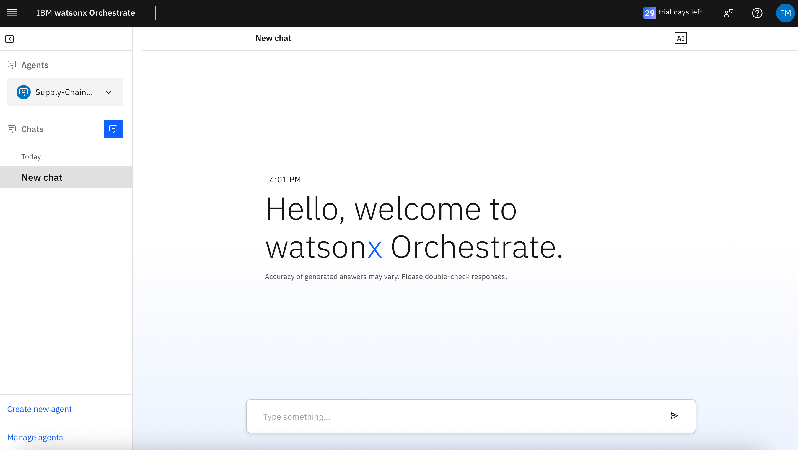

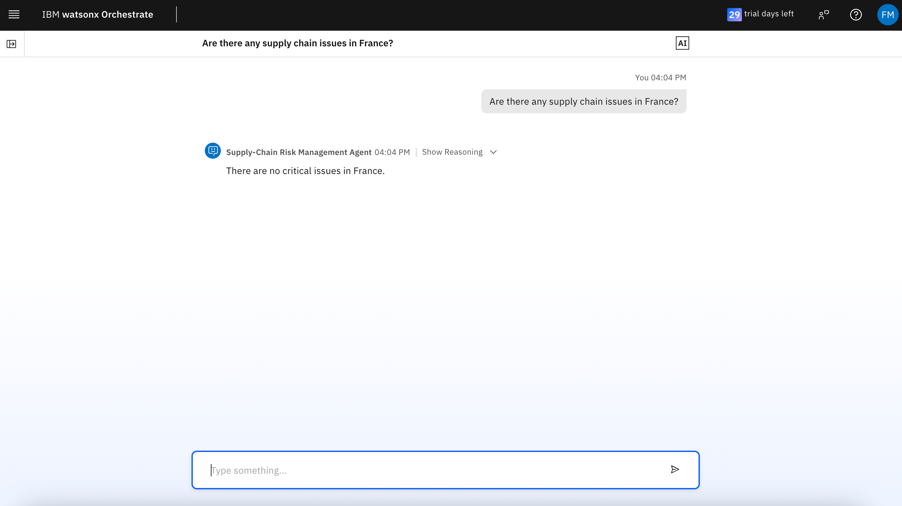

2. Try other questions:
```
- Are there any supply issues in Munich?
- What's the weather forecast in Munich?
- What are the most critical supply chain issues right now?
- Who is suppling the Material ID MAT-654?
- Which suppliers are causing the most problems lately?
- List events of the Acme PharmaChem (SUP-001)
- List 3 recent events of Acme PharmaChem (SUP-001)
- What's the weather forecast in Rotterdam Port?
- For the EVT-438a5b2f tell me what actions to take
- What alternative suppliers for Buffer Solution can I consider?
- For the EVT-64b91438 tell me what actions to take
- What could be the reason?
- Provide me a email letter in regards to recommended actions
```
Tool used: all tools

