# Supply Chain Risk Management Agent - System Architecture

## System Overview

The following diagram illustrates the complete architecture and workflow of the Supply Chain Risk Management Agent implemented with Watsonx Orchestrate:

```mermaid
graph TD
    A[User Query] --> B{Query Type Analysis}
    
    B -->|"recent events, critical issues<br/>suppliers, materials, locations"| C[Get Recent Supply Events Tool]
    B -->|"EVT-[ID] specific<br/>analyze event, details"| D[Get Event Details by ID Tool]
    B -->|"weather forecast<br/>location weather"| E[Get Weather Data Tool]
    
    C --> F[Supply Chain Data]
    D --> G[Specific Event Data]
    E --> H[Weather Information]
    
    F --> I{Risk Level Assessment}
    G --> I
    H --> J[Weather Analysis]
    
    I -->|Critical| K["🚨 CRITICAL RESPONSE<br/>- APIs + delays >24h<br/>- Inventory <5 days<br/>- Immediate action required"]
    I -->|High| L["HIGH PRIORITY RESPONSE<br/>- APIs with any delay<br/>- Excipients + delays >24h<br/>- Action within 24 hours"]
    I -->|Medium/Low| M["STANDARD RESPONSE<br/>- Non-APIs with delays<br/>- Routine disruptions<br/>- Regular monitoring"]
    
    J --> N[Weather-based Recommendations]
    
    K --> O[Formatted Response]
    L --> O
    M --> O
    N --> O
    
    O --> P[Deploy to Watsonx Orchestrate]
    P --> Q[Live Agent Available]
    
    subgraph "Watsonx Orchestrate Platform"
        R[IBM Cloud Portal]
        S[Trial Instance]
        T[Agent Creation Interface]
        U[Toolset Management]
        V[Agent Behavior Configuration]
        W[Live Deployment]
    end
    
    subgraph "Agent Core Functions"
        X[Risk Assessment]
        Y[Real-Time Monitoring]
        Z[Supplier Intelligence]
        AA[Critical Material Alerts]
        BB[Location Analysis]
    end
    
    subgraph "Response Formats"
        CC["Overview Format:<br/>CRITICAL ISSUES: [count]<br/>HIGH PRIORITY: [count]<br/>KEY RECOMMENDATIONS"]
        DD["Event Analysis Format:<br/>EVENT: EVT-[ID]<br/>RISK LEVEL: [Level]<br/>SITUATION & ACTIONS"]
        EE["Supplier Analysis Format:<br/>TOP PROBLEM SUPPLIERS<br/>RECOMMENDATIONS"]
    end
    
    Q --> X
    Q --> Y
    Q --> Z
    Q --> AA
    Q --> BB
    
    O --> CC
    O --> DD
    O --> EE
    
    style K fill:#ff9999
    style L fill:#ffcc99
    style M fill:#99ccff
    style A fill:#e1f5fe
    style Q fill:#c8e6c9
```

## Architecture Components

### Query Processing Flow
1. **User Input**: Natural language queries about supply chain status
2. **Query Analysis**: Intelligent routing to appropriate tools based on keywords
3. **Tool Execution**: Three specialized tools for different data sources
4. **Risk Assessment**: Automated categorization of issues by severity
5. **Response Formatting**: Structured outputs optimized for decision-making

### Core Tools
- **Get Recent Supply Events**: Monitors latest disruptions across suppliers and materials
- **Get Event Details by ID**: Provides detailed analysis of specific events (EVT-ID format)
- **Get Weather Data**: Delivers location-based weather information for logistics planning

### Risk Categorization
- **🚨 Critical**: APIs with delays >24h or inventory <5 days
- **⚠️ High**: Any API delays or excipients with delays >24h
- **📋 Medium/Low**: Non-critical materials or routine disruptions

This architecture enables real-time supply chain intelligence with automated risk assessment and actionable recommendations.
