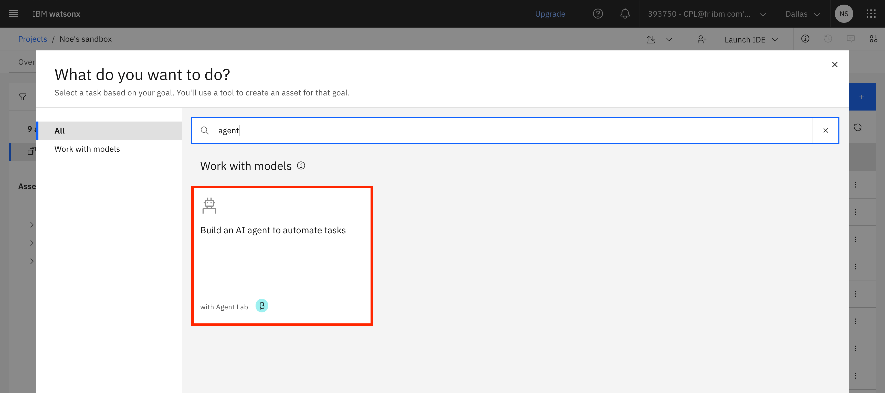
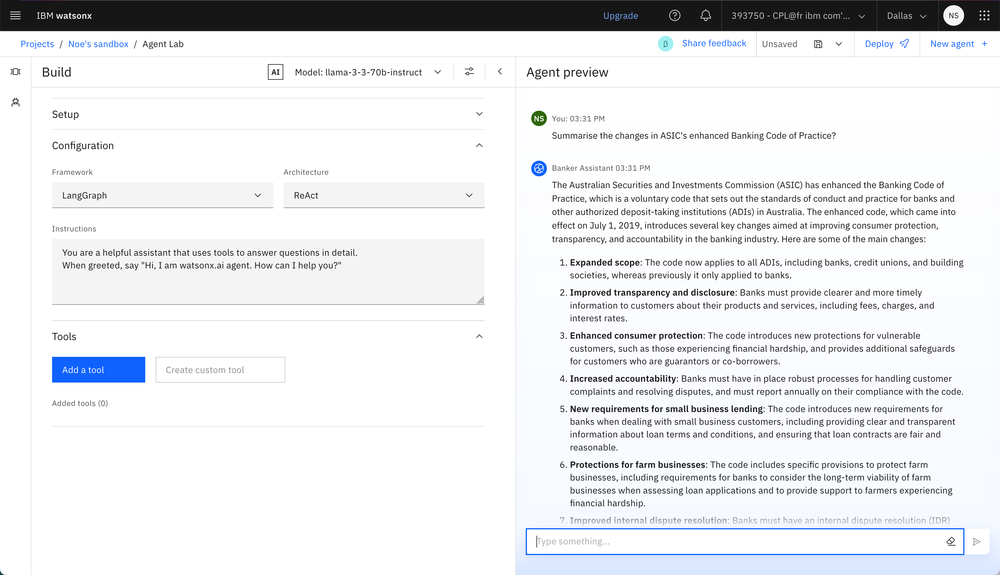
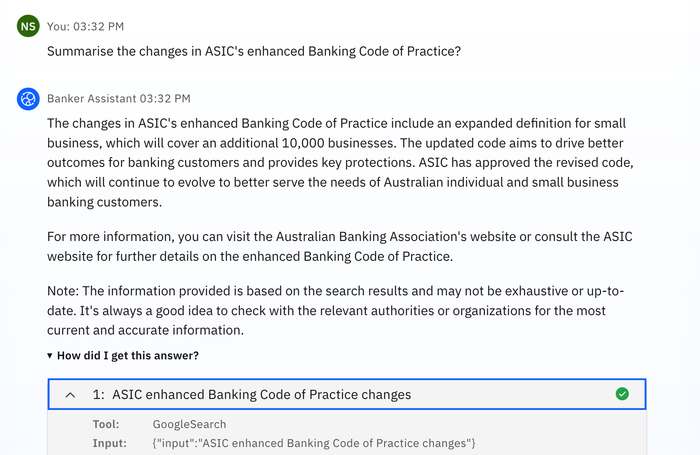
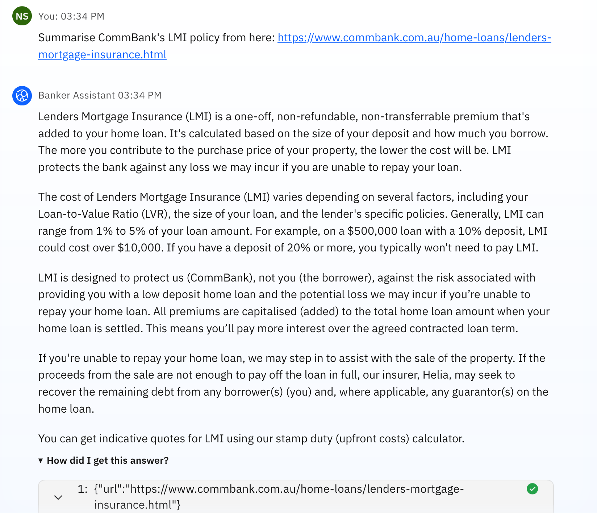
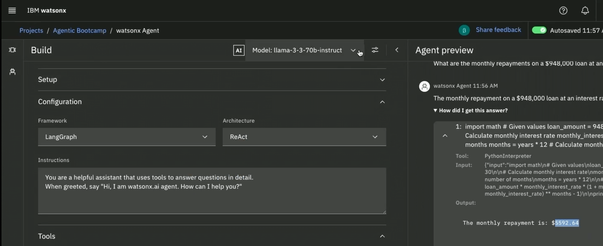
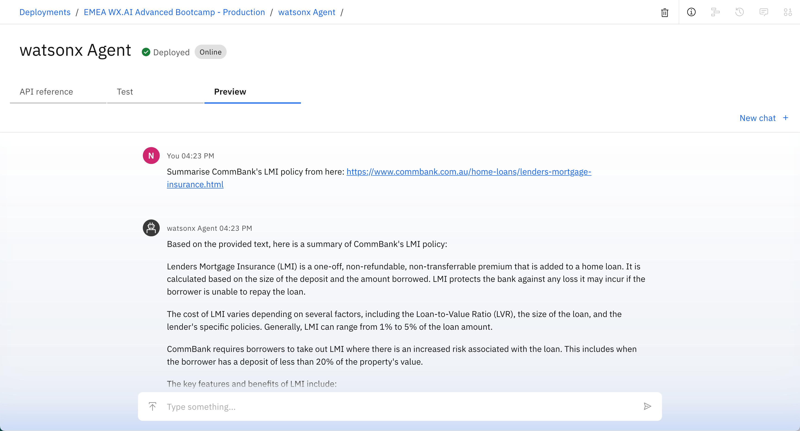

# Hands-on Lab: watsonx.ai Agent Lab

## Introduction

In this hands-on lab, you will learn how to build agentic workflows using AgentLab, a powerful tool for creating custom AI-powered agents. You will follow the story of Billie, a banker who wants to use AI to help with her workload.

Through a series of exercises, you will learn how to:

* Create a custom agent using watsonx.ai AgentLab
* Use Large Language Models (LLMs) in your agent
* Use tools to access information not previously trained into the LLM
* Trace the agent's ReAct process
* Incorporate business logic into your agent using custom tools

## Contents

- [Hands-on Lab: watsonx.ai Agent Lab](#hands-on-lab-watsonxai-agent-lab)
  - [Introduction](#introduction)
  - [Contents](#contents)
  - [Prerequisites](#prerequisites)
  - [Lab Objectives](#lab-objectives)
  - [Lab Instructions](#lab-instructions)
    - [Step 1: Get started with Agent Lab](#step-1-get-started-with-agent-lab)
    - [Step 2: Add a `Google search` tool](#step-2-add-a-google-search-tool)
    - [Step 3: Add a `Webcrawler` tool](#step-3-add-a-webcrawler-tool)
    - [Step 4: Ingest documents for Q\&A](#step-4-ingest-documents-for-qa)
    - [Step 5: Allow your agent to perform calculations](#step-5-allow-your-agent-to-perform-calculations)
    - [Step 6: Add a Custom Tool](#step-6-add-a-custom-tool)
    - [Step 7: Deploy your Agent](#step-7-deploy-your-agent)
  - [Conclusion](#conclusion)
  - [Additional Resources](#additional-resources)

## Prerequisites

You must have access to a watsonx.ai SaaS environment and an initialized project within that environment. If you do not have one already, it can be provisioned on [TechZone](https://techzone.ibm.com/collection/tech-zone-certified-base-images/journey-watsonx) by selecting the **watsonx.ai/.governance SaaS** environment and selecting **Education** as **Purpose**.


## Lab Objectives

* Create a custom tool to access information not previously trained into an LLM
* Use the WebCrawler tool to extract information from a specific web page
* Integrate a Python interpreter to perform complex calculations
* Use RAG to incorporate new information into an existing agent* Deploy an agent with a custom tool to incorporate business logic

## Lab Instructions

### Step 1: Get started with Agent Lab

1. From the [watsonx.ai home page](https://dataplatform.cloud.ibm.com/wx/home?context=wx), navigate to a project, and then click the **New asset > Build an AI agent to automate tasks** tile.

    
    
2. Select a foundation model and optionally update model parameters. For details, see [Foundation model configuration](#model).
    
3. To set up your agent, specify a name for the agent and describe the tasks the agent performs in the **Setup** section.
    
4. _Optional_: Select an icon and background image to customize how your agent appears in the **Agent Preview** pane.
    
5. Select the AI agent framework you want to use to create, deploy and, manage your agent.
    
    **Note**: Currently, watsonx.ai offers `LangGraph` as the only framework choice.
    
6. Select the architecture that implements agentic AI reasoning.
    
    **Note**: Currently, watsonx.ai offers `ReAct` as the only architecture choice.
    
7. Define specific instructions for your agent that is used to create a system prompt for the selected foundation model. The instructions can include using a specific language, date or time format, user greeting, or an external tool as an information source instead of a foundation model's knowledge base.
    
8. In the tools section, make sure **No tools** are enabled by default, remove them if needed.

9.  Now, we're going to try making an LLM call on a new standard without having any access to tools. Try the following prompt in AgentLab without any tools. 

    ```
    Summarise the changes in ASIC's enhanced Banking Code of Practice?
    ```

    

**Note** that the LLM was trained before this new Code of Practice, and therefor provides an outdated answer. 

### Step 2: Add a `Google search` tool

Now we'll add the Google Tool and try the same prompt:

1. In the **Tools** section, click **Add a tool** and select the **Google search** tool that the agent framework can invoke to compose a response.
    
2. _Optional_: Add some sample questions that the end user can use to start interacting with the agent, like.:

    ```
    Summarise the changes in ASIC's enhanced Banking Code of Practice?
    ```
    
3. Test your agent in the **Agent preview** pane to make sure the agent generates the correct result by using a combination of the foundation model and the relevant tools. You can now ask:

    ```
    Summarise the changes in ASIC's enhanced Banking Code of Practice?
    ```

    

**Note** that after adding the Google search tool and trying the same prompt, your agent is now referencing the latest changes to the code of practice. In the result, if you click on **How did I get this answer?**, you can get the full trace of your agent's reasoning and actions.

### Step 3: Add a `Webcrawler` tool

What if we wanted to get details from a specific website? Well Billie could use the webscraping tool:

1. In the **Tools** section, click **Add a tool** and select the **Webcrawler** tool that the agent framework can invoke to compose a response.

2. Test your agent in the **Agent preview** pane to make sure the agent generates the correct result by using a combination of the foundation model and the relevant tools. You can now ask:

    ```
    Summarise CommBank's LMI policy from here: https://www.commbank.com.au/home-loans/lenders-mortgage-insurance.html
    ```

    

**Note** that now, your agent will summarise the details from that specific website by crawling that page directly.

### Step 4: Ingest documents for Q&A

But Billie needs some more details, what if she had a specific document that she wanted to ground her answers in, rather than using a site what if there was an internal policy:

1. Save your agent in your project by clicking the save Icon on the top, and **Save as**. Select **Agent** and click **Save**.
2. Navigate to your watsonx.ai project, and then click the **New asset > Ground gen AI with vectorized documents** tile.
3. Upload the attached `lenders_mortgage_insurance.pdf` document, give it the following description, then click **Create**.
    ```
    The following document contains details about CommBank's lenders mortgage insurance policy. When it might apply, product disclosures, faqs and provides an overall guide.
    ```
4. In your project, open your agent in the Agent Lab.
5. In the **Tools** section, click **Add a tool** and select the **Document search** and select the `lenders_mortgage_insurance` vector index that your just created. Click **Select**.
6. Just like that, you've enabled your agent to use RAG and ground some of it's answers in the document, you can test it by asking one of the following:

    ```
    when would LMI apply?
    ```

    ```
    what is the minimum deposit that would not require LMI?
    ```

    

**Note** that your agent uses the `RAGQuery` tool to answer your question from the document.

### Step 5: Allow your agent to perform calculations

What if Billie, got a question from a customer on a loan product that they'd newly inherited?

1. In the **Tools** section, click **Add a tool** and select the **Python interpreter** tool that the agent framework can invoke to compose a response.

2. Test your agent in the **Agent preview** pane to make sure the agent generates the correct result by using a combination of the foundation model and the relevant tools. You can now ask:

    ```
    What are the monthly repayments on a $948,000 loan at an interest rate of 5.85% over 30 years
    ```

**Note** that your agent is translating your query into a python calculation that he then performs to answer your question.

### Step 6: Add a Custom Tool

Now let's say that the Bank introduces a new wealth builder fee of `$3000` over the life of the loan which gets added onto monthly payments, how could Billie factor this into her agent? This is where custom tools come in.

1. In the **Tools** section, click **Create custom tool**.
   1. **Name**: Enter `Repayment Calculation`
   2. **Tool description**:
        ```
        Tool that calculates morgage repayments.
        ```
        **Note**: this description is very important, it will be used by the LLM to know when to call this custom tool.
   3. **Input JSON Schema**:
        ```json
        {
        "principal": {
            "title": "Principal loan amount",
            "description": "The total loan amount",
            "type": "number"
        },
        "interest_rate": {
            "title": "Yearly interest rate",
            "description": "The yearly interest rate to be charged",
            "type": "number"
        },
        "period": {
            "title": "Loan Period",
            "description": "The length of the loan in years.",
            "type": "integer"
        }
        }
        ```
        **Note**: this schema is very important, it will be used by the LLM to know how to call this tool with the required input parameters.
   4. **Python code**:

        ```py
        def monthly_repayment(principal: float, interest_rate: float, period: int):
            interest_rate = interest_rate / 100
            return (
                principal
                * (interest_rate / 12 * (1 + interest_rate / 12) ** (period * 12))
                / ((1 + interest_rate / 12) ** (period * 12) - 1)
            ) + 3000 / period
        ```

2. Test your agent in the **Agent preview** pane to make sure the agent generates the correct result by using a combination of the foundation model and the relevant tools. You can now ask:

    ```
    What are the monthly repayments on a $948,000 loan at an interest rate of 5.85% over 30 years.
    ```

    

**Note** that your agent is translating your query into a python calculation that he then performs to answer your question.

### Step 7: Deploy your Agent

You are now ready to deploy your agent as a new AI service:

1. In the top action bar, click **Deploy**.
2. Select your target deployment space. If you don't have one, you can [create](https://www.ibm.com/docs/en/watsonx/saas?topic=spaces-creating-deployment) one.
3. After a few seconds, your watsonx Agent will be initialized and deployed in the target deployment space.
4. Once deployed, click on your new agent and test it by asking it any of the previous questions in the **Preview** section:

    

This concludes the lab exercise.

## Conclusion

In this hands-on lab, you learned how to build agentic workflows using AgentLab. You created custom tools, used the WebCrawler tool, integrated a Python interpreter, used RAG, and deployed an agent with a custom tool. By applying these skills, you can automate tasks and make informed decisions in your own organization.

## Additional Resources

* watsonx.ai Agents quickstart: [link](https://www.ibm.com/watsonx/developer/agents/quickstart)
* Agent Lab documentation: [link](https://www.ibm.com/docs/en/watsonx/saas?topic=solutions-agent-lab-beta)
* watsonx Developer Hub: [link](https://developer.ibm.com/components/watsonx-ai)
